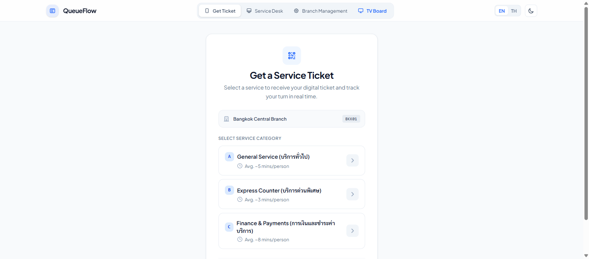
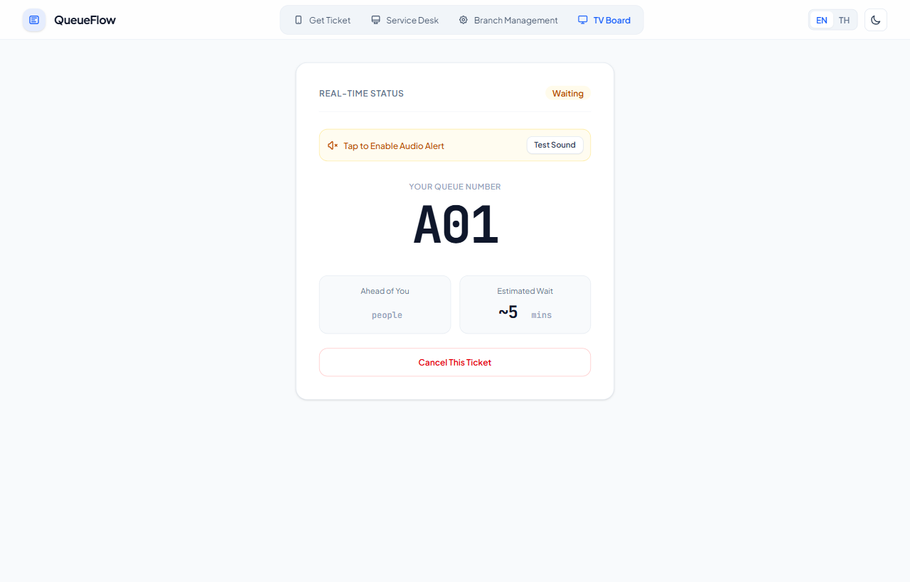
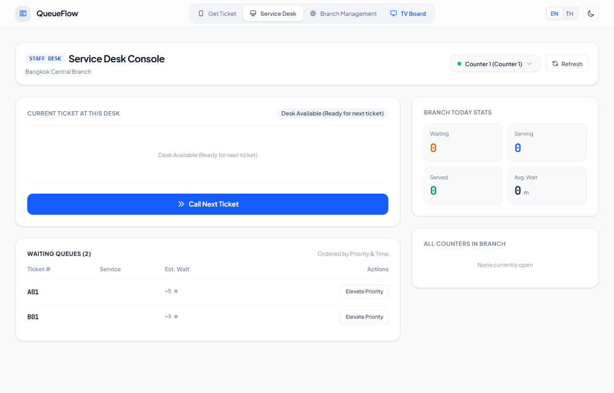
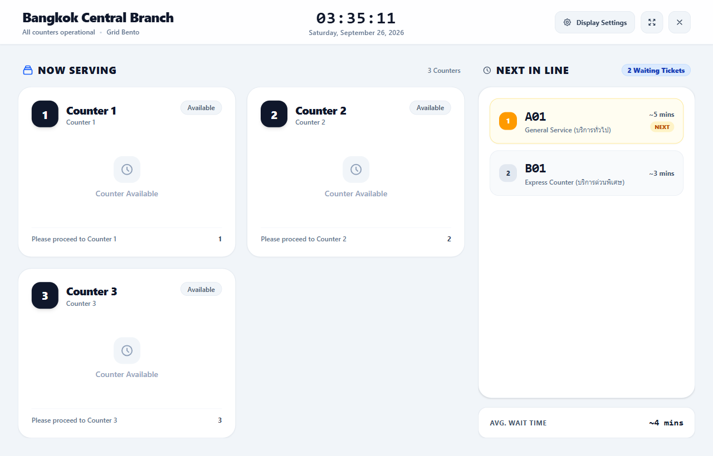
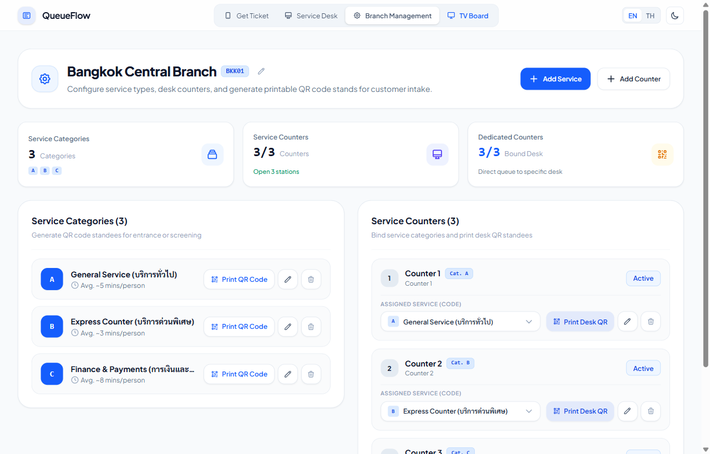
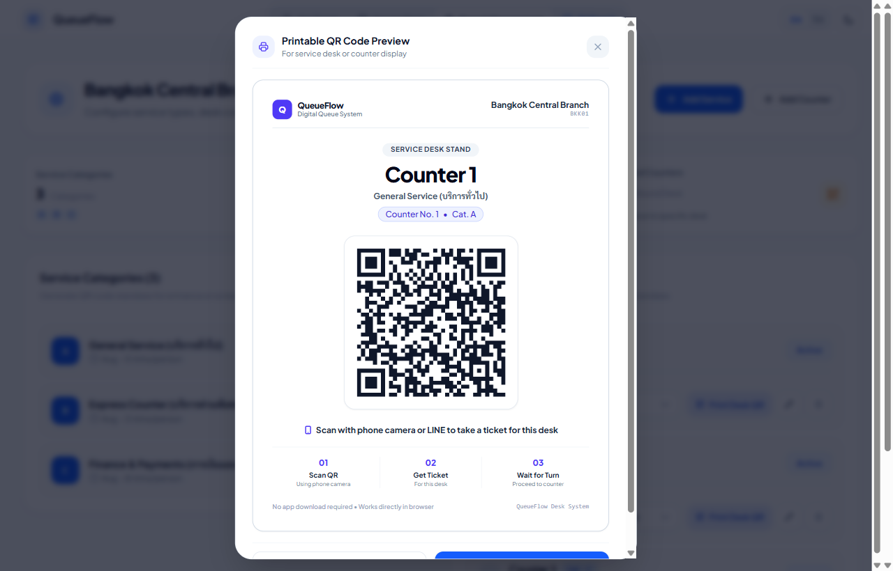
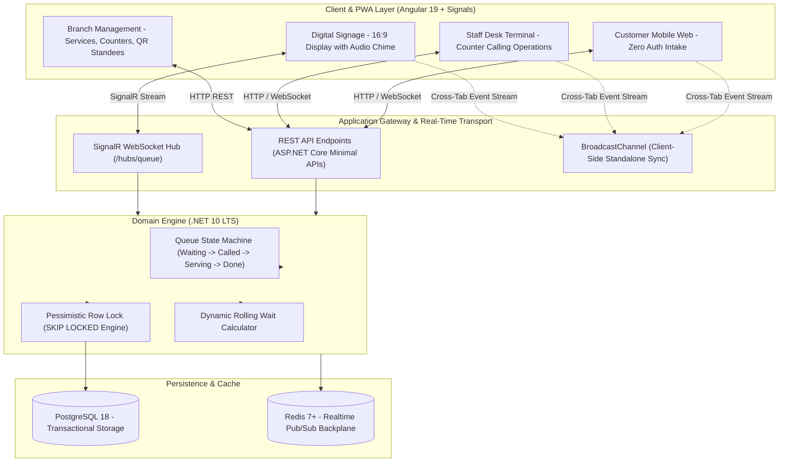

<div align="center">

# QueueFlow

### Enterprise Real-Time Distributed Queue Management System
**ระบบบริหารจัดการคิวและเคาน์เตอร์บริการแบบเรียลไทม์ระดับองค์กร**

[](https://queueflow-wheat.vercel.app)
[](https://angular.dev)
[](https://dotnet.microsoft.com)
[](https://web.dev/progressive-web-apps/)
[](https://tailwindcss.com)
[](https://postgresql.org)

<br />

**[English Documentation](#english) • [เอกสารภาษาไทย](#ภาษาไทย)**

<br />

</div>

---

## 🖼️ Visual Interface Showcase (ภาพรวมหน้าจอระบบ)

| 📱 Customer Mobile Intake (จุดกดรับบัตรคิว) | 🎫 Real-time Digital Pass (บัตรคิวดิจิทัล) |
|:---:|:---:|
| [](https://queueflow-wheat.vercel.app/queue/join) | [](https://queueflow-wheat.vercel.app/queue/demo-token-a01) |
| *เลือกประเภทบริการ & คำนวณเวลารอเรียลไทม์* | *ติดตามสถานะคิว, จำนวนคิวด้านหน้า & QR สำหรับเช็คอิน* |

| 🖥️ Staff Desk Terminal (เคาน์เตอร์เจ้าหน้าที่) | 📺 TV Digital Signage (จอแสดงผล 16:9) |
|:---:|:---:|
| [](https://queueflow-wheat.vercel.app/staff/dashboard) | [](https://queueflow-wheat.vercel.app/display) |
| *เรียกคิวถัดไป, ขานซ้ำ, เริ่มบริการ, สถิติประจำวัน* | *จอแสดงผลหมายเลขคิว พร้อมเสียง Chime และขานชื่อภาษาไทย* |

| ⚙️ Branch Management (จัดการสาขาและโต๊ะบริการ) | 🖨️ Printable QR Standee (ป้ายตั้งโต๊ะพิมพ์ได้) |
|:---:|:---:|
| [](https://queueflow-wheat.vercel.app/admin/management) | [](https://queueflow-wheat.vercel.app/admin/management) |
| *ตั้งค่าหมวดหมู่บริการ (Service Code), ผูกโต๊ะบริการ* | *สร้างป้ายตั้งเคาน์เตอร์และทางเข้า พิมพ์ขนาด A4 พับสามเหลี่ยมทันที* |

<a name="english"></a>
## English Documentation

### 1. Product Overview (The 7 Pillars)

#### Who (Target Audience & Personas)
* **Customers & Visitors**: Patients in medical clinics, banking hall clients, repair center patrons, and government service visitors who need real-time queue visibility without standing in crowded waiting rooms.
* **Service Counter Staff**: Tellers, customer service representatives, and triage nurses operating dedicated physical or virtual service desks.
* **Branch Supervisors & Managers**: Floor managers monitoring throughput, active counter states, bottleneck alerts, and average waiting time SLAs.
* **System Administrators**: Multi-tenant platform operators configuring organizations, managing service categories, and auditing operational logs.

#### Problem
1. **Waiting Room Congestion**: Customers are physically bound to lobbies without transparency into remaining wait times or current serving positions.
2. **Double-Call Concurrency Collisions**: In high-velocity service environments, multiple staff members hitting "Call Next" simultaneously risk duplicate ticket assignments.
3. **Hardware Lock-in & Licensing Costs**: Traditional queue hardware vendors charge recurring per-terminal licensing and necessitate proprietary thermal printers.

#### Solution
* **Zero-Friction Mobile Web Intake**: Customers scan a service QR code, pick their service category, and receive a cryptographically tokenized digital pass directly on their smartphone.
* **Pessimistic Concurrency Engine**: PostgreSQL `SELECT ... FOR UPDATE SKIP LOCKED` guarantees absolute mutual exclusion across concurrent counter requests.
* **Bi-Directional Real-Time Push**: SignalR WebSocket channels update customer positions, staff terminals, and public displays with sub-millisecond latency.
* **Client-First PWA Architecture**: Operates as a Progressive Web App installable on iOS, Android, tablets, and smart TVs with offline shell support and zero native app downloads.

---

### 2. Live Demo & Portals

The application is deployed on Vercel as a high-performance, standalone Progressive Web App (PWA):

| Interface Portal | Route | Primary Use Case | Live Access |
|---|---|---|---|
| **Customer Intake** | `/queue/join` | Mobile intake with service selection and instant token issuance | [Launch Customer Portal](https://queueflow-wheat.vercel.app/queue/join) |
| **Staff Desk Terminal** | `/staff/dashboard` | Calling next ticket, recall chime, start service, skip, no-show | [Launch Staff Terminal](https://queueflow-wheat.vercel.app/staff/dashboard) |
| **TV Digital Signage** | `/display` | 16:9 full-screen digital display with audio chime and bilingual speech | [Launch TV Signage](https://queueflow-wheat.vercel.app/display) |
| **Branch Management** | `/admin/management` | Configure services, counter bindings, and generate printable QR standees | [Launch Admin Console](https://queueflow-wheat.vercel.app/admin/management) |

> [!TIP]
> **Multi-Window Real-Time Simulation**: Open the [Staff Terminal](https://queueflow-wheat.vercel.app/staff/dashboard) in one window and the [TV Display](https://queueflow-wheat.vercel.app/display) in another window. When you click **"Call Next"** on the staff desk, the TV display instantly rings the service chime and synthesizes the voice announcement in real time via the integrated event bus!

---

### 3. Core Capabilities

* **Intelligent Intake & EWT**: Computes rolling-average Estimated Waiting Time (EWT) dynamically based on historical service duration and active counter capacity.
* **Cross-Counter Priority Dispatch**: Allows VIP ticket priority elevation, service transfers, and multi-service teller routing.
* **Acoustic & Voice Synthesis**: Uses Web Audio API for custom chime frequencies and Web Speech API for localized ticket calling in Thai and English.
* **Printable Standee Generator**: Automatically renders print-ready SVG QR codes for physical counter stands and triage kiosks (A4 and table tent format).
* **Dual Runtime Engine**: Runs seamlessly as a serverless in-memory PWA on Vercel or connected to a high-scale .NET 10 LTS container backend with PostgreSQL.

---

### 4. Technical Architecture



---

### 5. Engineering Craftsmanship & Concurrency Evidence

#### Double-Call Race Condition Immunity
When multiple counter operators click "Call Next" in the same millisecond, standard database queries suffer from race conditions resulting in double ticket assignments. QueueFlow resolves this at the database engine level:

```csharp
// Atomically locks the next waiting ticket, bypassing rows locked by other concurrent transactions
var ticket = await _dbContext.Tickets
    .FromSqlRaw(@"
        SELECT * FROM ""Tickets""
        WHERE ""BranchId"" = {0} AND ""Status"" = 0
        ORDER BY ""Priority"" DESC, ""IssuedAt"" ASC
        LIMIT 1
        FOR UPDATE SKIP LOCKED", branchId)
    .FirstOrDefaultAsync(cancellationToken);
```

#### Verification & Automated Test Suite
All domain state machine transitions, priority escalation rules, and concurrency locks are covered by automated unit and integration tests passing with **Exit Code 0**:

```powershell
dotnet test backend/QueueFlow.Tests/QueueFlow.Tests.csproj --nologo -v q
# Passed! - Failed: 0, Passed: 7, Skipped: 0, Total: 7, Duration: 1 s
```

---

### 6. Local Development Quickstart

#### Prerequisites
* Node.js 22+ & npm
* .NET 10 LTS SDK

```powershell
# 1. Clone the repository
git clone https://github.com/ZillerDX/QueueFlow.git
cd QueueFlow

# 2. Launch Backend (.NET 10 LTS)
cd backend/QueueFlow.Api
dotnet run --urls "http://localhost:5080"

# 3. Launch Frontend (Angular 19 Dev Server with HMR)
cd ../../queueflow-web
npm install
npx ng serve --port 4200
```

Open [http://localhost:4200](http://localhost:4200) in your browser.

---

<br />

<a name="ภาษาไทย"></a>
## เอกสารภาษาไทย (Thai Documentation)

### 1. ภาพรวมผลิตภัณฑ์และ 7 เสาหลัก (The 7 Pillars)

#### ใครคือผู้ใช้งาน (Who)
* **ผู้รับบริการ / ลูกค้า (Customers)**: ผู้ป่วยในคลินิก, ลูกค้าธนาคาร, ผู้มาซ่อมอุปกรณ์, หรือประชาชนผู้มาติดต่อหน่วยงาน ที่ต้องการความสะดวกในการติดตามคิวผ่านมือถือโดยไม่ต้องยืนเบียดเสียดในห้องรอ
* **พนักงานประจำเคาน์เตอร์ (Staff Desk)**: เจ้าหน้าที่ประจำจุดบริการที่ต้องเรียกคิว, ขานซ้ำ, เริ่มให้บริการ, ข้ามคิว หรือแจ้งสละสิทธิ์ได้อย่างสะดวกรวดเร็ว
* **ผู้จัดการสาขา (Branch Supervisors)**: ผู้ดูแลภาพรวมการให้บริการ ตรวจสอบอัตราการไหลของคิว ประสิทธิภาพของแต่ละเคาน์เตอร์ และแจ้งเตือนเมื่อเวลารอเกิน SLA
* **ผู้ดูแลระบบ (Administrators)**: ผู้กำหนดโครงสร้างสาขา จัดการประเภทบริการ (Service Code) และตั้งค่าโต๊ะบริการ

#### ปัญหาที่พบในระบบเดิม (Problem)
1. **ความแออัดในพื้นที่รอรับบริการ**: ลูกค้าไม่รู้เวลารอที่แน่นอน ทำให้ต้องนั่งเฝ้าหน้าจอทีวีหรือตู้กดคิวตลอดเวลา
2. **การเรียกคิวซ้ำซ้อน (Race Condition)**: เมื่อเจ้าหน้าที่หลายเคาน์เตอร์กด "เรียกคิวถัดไป" พร้อมกันในเสี้ยววินาที ระบบทั่วไปอาจจ่ายบัตรคิวใบเดียวกันให้สองเคาน์เตอร์พร้อมกัน
3. **ต้นทุนฮาร์ดแวร์สูง**: ตู้บัตรคิวแบบดั้งเดิมมีค่าไลเซนส์รายปี และต้องพึ่งพาตู้พิมพ์กระดาษความร้อนที่สิ้นเปลือง

#### โซลูชันของ QueueFlow (Solution)
* **สแกนรับคิวผ่านมือถือ (Zero-Friction Intake)**: สแกน QR Code แล้วเลือกบริการผ่านเว็บเบราว์เซอร์ได้ทันที ได้รับบัตรคิวแบบดิจิทัลพร้อมความปลอดภัยระดับโทเคน
* **ระบบล็อกแถวฐานข้อมูลแบบ Pessimistic Locking**: ใช้คำสั่ง `SELECT ... FOR UPDATE SKIP LOCKED` บน PostgreSQL การันตีไม่มีการเรียกคิวซ้ำซ้อน 100%
* **การสื่อสารแบบเรียลไทม์สองทาง**: SignalR WebSocket แจ้งเตือนการเปลี่ยนสถานะคิวไปยังมือถือลูกค้าและจอทีวีโดยไม่ต้องรีเฟรชหน้าเว็บ
* **สถาปัตยกรรม PWA**: ติดตั้งลงบนมือถือ แท็บเล็ต หรือสมาร์ททีวีเป็นแอปพลิเคชันได้ทันทีโดยไม่ต้องผ่าน App Store

---

### 2. ทางเข้าใช้งานระบบทดสอบ (Live Portals)

ระบบเปิดให้บริการทดสอบแบบ Standalone Progressive Web App (PWA) บน Vercel:

| พอร์ทัลการใช้งาน | เส้นทาง URL | วัตถุประสงค์หลัก | ลิงก์เข้าใช้งาน |
|---|---|---|---|
| **จุดกดรับบัตรคิวลูกค้า** | `/queue/join` | สแกนเลือกประเภทบริการและรับบัตรคิวดิจิทัล | [เปิดหน้าจอลูกค้า](https://queueflow-wheat.vercel.app/queue/join) |
| **เคาน์เตอร์บริการพนักงาน** | `/staff/dashboard` | เรียกคิวถัดไป, ขานซ้ำ, เริ่มบริการ, ข้ามคิว, ยกเลิกคิว | [เปิดหน้าจอพนักงาน](https://queueflow-wheat.vercel.app/staff/dashboard) |
| **จอแสดงผลดิจิทัลทีวี** | `/display` | จอแสดงผลแบบ 16:9 พร้อมเสียงระฆังและเสียงพูดขานคิว | [เปิดหน้าจอทีวี](https://queueflow-wheat.vercel.app/display) |
| **ระบบจัดการสาขาและเคาน์เตอร์** | `/admin/management` | จัดการประเภทบริการ ผูกเคาน์เตอร์ และพิมพ์ป้าย QR Code | [เปิดหน้าจอแอดมิน](https://queueflow-wheat.vercel.app/admin/management) |

> [!TIP]
> **วิธีทดสอบระบบเรียลไทม์ข้ามหน้าต่าง**: ให้คุณเปิดหน้าจอ [เคาน์เตอร์บริการพนักงาน](https://queueflow-wheat.vercel.app/staff/dashboard) ในหน้าต่างหนึ่ง และเปิดหน้าจอ [จอแสดงผลทีวี](https://queueflow-wheat.vercel.app/display) อีกหน้าต่างหนึ่ง เมื่อกดปุ่ม **"เรียกคิวถัดไป"** จอแสดงผลทีวีจะส่งเสียงกระดิ่ง Chime และขานหมายเลขคิวเป็นภาษาไทยแบบเรียลไทม์ทันที!

---

### 3. คุณสมบัติเด่นของระบบ

* **การคำนวณเวลารออัจฉริยะ (EWT)**: ประเมินเวลารอคอยเฉลี่ยแบบไดนามิกโดยคำนวณจากระยะเวลาให้บริการจริงและจำนวนเคาน์เตอร์ที่เปิดอยู่
* **ระบบจัดการความสำคัญ (Priority Handling)**: ยกระดับความสำคัญของคิวพิเศษ (ผู้สูงอายุ, เคสฉุกเฉิน) ให้อยู่ลำดับต้นแบบอัตโนมัติ
* **เสียงขานสังเคราะห์ 2 ภาษา**: ใช้ Web Audio API สร้างเสียงระฆังนุ่มนวล และ Web Speech API สังเคราะห์เสียงขานหมายเลขคิวภาษาไทยและอังกฤษ
* **เครื่องมือสร้างป้าย QR Code ตั้งโต๊ะ**: สร้างป้ายตั้งเคาน์เตอร์และป้ายทางเข้าพร้อมพิมพ์ขนาด A4 พับสามเหลี่ยมได้จากหน้าแดชบอร์ด

---

### 4. สถาปัตยกรรมทางเทคนิค

* **Frontend**: Angular 19+, TypeScript, Angular Signals, Tailwind CSS v4, Progressive Web App (PWA)
* **Backend**: C# 14, **.NET 10 LTS (`net10.0`)**, ASP.NET Core Minimal APIs, Entity Framework Core 10, SignalR WebSocket
* **Database**: PostgreSQL 18 (Production) / SQLite (Local Development)
* **Caching**: Redis 7+ Pub/Sub Backplane

---

### 5. การติดตั้งและรันในเครื่อง (Local Setup)

```powershell
# 1. โคลนคลังโค้ด
git clone https://github.com/ZillerDX/QueueFlow.git
cd QueueFlow

# 2. เริ่มต้นรัน Backend (.NET 10)
cd backend/QueueFlow.Api
dotnet run --urls "http://localhost:5080"

# 3. เริ่มต้นรัน Frontend (Angular 19)
cd ../../queueflow-web
npm install
npx ng serve --port 4200
```

เปิดเบราว์เซอร์ไปที่ [http://localhost:4200](http://localhost:4200) เพื่อเริ่มใช้งาน

---

### 6. ใบอนุญาต (License)

ซอฟต์แวร์นี้เผยแพร่ภายใต้ใบอนุญาต **MIT License** — สามารถนำไปพัฒนา ต่อยอด หรือใช้งานในเชิงพาณิชย์ได้อย่างเสรี
