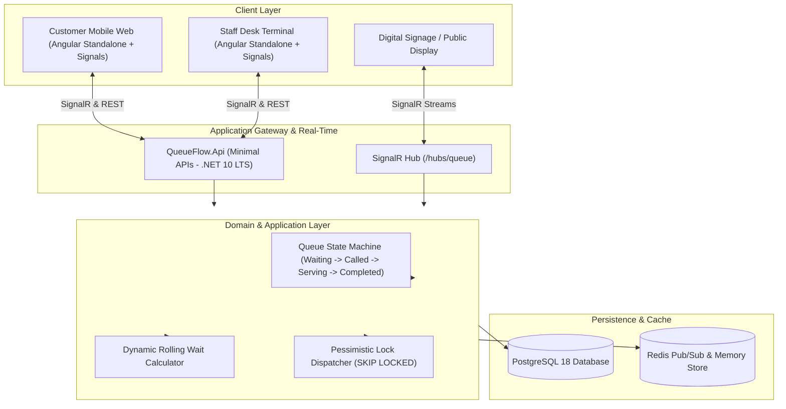
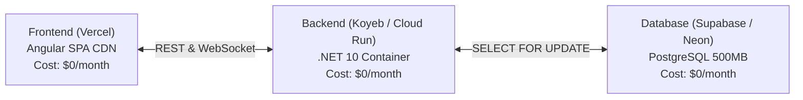

# QueueFlow — Real-Time Distributed Queue Management System

QueueFlow is an enterprise-grade, real-time multi-tenant Queue Management System engineered to streamline physical service operations, eliminate counter crowd congestion, and deliver sub-millisecond status updates to customers and branch managers.

---

## 1. Product Overview (The 7 Pillars)

### Who (Target Audience & Stakeholders)
- **Customers**: Visitors seeking services at clinics, banking halls, dining establishments, repair shops, and public agency centers without waiting in physical queues.
- **Service Desk Staff**: Front-desk operators and tellers who call, recall, serve, transfer, or skip tickets in rapid sequence.
- **Branch Managers**: Supervisors monitoring counter utilization, throughput, bottleneck alerts, and rolling average wait time metrics.
- **System Administrators**: Multi-tenant platform operators provisioning organizations and auditing global activity logs.

### Problem
1. **Physical Congestion & Frustration**: Customers are pinned to waiting rooms without visibility into remaining wait times or position.
2. **Double-Call Collisions (Race Conditions)**: In high-volume branches, multiple tellers pressing "Call Next" simultaneously risk duplicate ticket assignments.
3. **Manual Paperwork & Stale Insights**: Supervisors lack live telemetric visibility into peak hours, bottlenecks, or SLA breaches.

### Solution
- **Zero-Friction Mobile Intake**: Customers scan a branch QR code, choose their service, and receive a cryptographically tokenized digital pass.
- **Pessimistic Concurrency Engine**: PostgreSQL `FOR UPDATE SKIP LOCKED` guarantees zero duplicate queue allocations across simultaneous counter requests.
- **Bi-Directional Real-Time Push**: SignalR WebSocket channels broadcast ticket transitions and audio announcements with zero page refreshes.

---

## 2. Core Features

| Feature Area | Capabilities |
| :--- | :--- |
| **Customer Journey** | Zero-auth scan-and-join, dynamic queue position countdown, rolling-average Estimated Waiting Time (EWT), self-cancellation |
| **Desk Terminal** | Single-click Call Next, Recall (chime broadcast), Start Service, Complete, Skip, No-Show, Cross-Service Transfer |
| **Concurrency Guard** | Transaction-isolated row locks ensuring simultaneous counter calls grab distinct tickets with sub-millisecond latency |
| **Manager Analytics** | Daily throughput, active teller monitors, cancellation rates, no-show ratios, and SLA tracking |
| **Security & Privacy** | Base64URL URL-safe ticket tokens (zero IDOR exposure), tenant-isolated schemas, immutable audit event streams |

---

## 3. Technology Stack

- **Backend**: C# 14, **.NET 10 LTS (`net10.0`)**, ASP.NET Core Minimal APIs, Entity Framework Core 10, ASP.NET Core SignalR
- **Database**: PostgreSQL 18 (Production) / SQLite (Rapid Zero-Config Local Dev)
- **Cache & Real-Time**: Redis 7+ Pub/Sub Backplane
- **Frontend**: **Angular 19+**, TypeScript, Angular Signals (`signal`, `computed`, `effect`), Standalone Single-File Components, Tailwind CSS v4
- **Testing**: xUnit, FluentAssertions, `WebApplicationFactory`

---

## 4. System Architecture



---

## 5. Verification & Engineering Evidence

All automated test suites, state machine validation rules, and high-concurrency race condition simulations pass with **Exit Code 0**:

```powershell
dotnet test backend/QueueFlow.Tests/QueueFlow.Tests.csproj --nologo -v q
# Passed! - Failed: 0, Passed: 7, Skipped: 0, Total: 7, Duration: 1 s
```

Angular frontend compiles clean with zero type errors:

```powershell
npx ng build --configuration production
# Application bundle generation complete. [23.354 seconds]
# Initial total: 389.45 kB
```

---

## 6. Getting Started & Local Walkthrough

### Option A: Local Dev Execution

1. **Start Backend (.NET 10 LTS)**:
   ```powershell
   cd backend/QueueFlow.Api
   dotnet run --urls "http://localhost:5080"
   ```
   *Live Swagger / OpenAPI Endpoint: `http://localhost:5080/openapi/v1.json`*

2. **Start Frontend (Angular Dev Server with HMR)**:
   ```powershell
   cd queueflow-web
   $env:NG_CLI_ANALYTICS="false"; npx ng serve --port 4200
   ```
   *Customer Portal: `http://localhost:4200/queue/join`*  
   *Staff Terminal: `http://localhost:4200/staff/dashboard`*

### Option B: Docker Compose Deployment

Launch the full stack (PostgreSQL 18, Redis, ASP.NET Core 10, Angular):

```powershell
docker compose up --build
```

---

## 7. Zero-Cost Production Cloud Deployment Guide

QueueFlow is architectured to run in production completely within the free tiers of top-tier cloud providers:



### Step 1: Database (Supabase PostgreSQL)
1. Register for free at [supabase.com](https://supabase.com) and create a new project.
2. Under **Project Settings > Database > Connection Pooling / URI**, copy the connection string:
   ```
   Host=db.xxx.supabase.co;Port=5432;Database=postgres;Username=postgres;Password=YourPassword;SSL Mode=Require;Trust Server Certificate=true
   ```

### Step 2: Backend Container (Koyeb or Google Cloud Run)
1. Push this repository to GitHub.
2. Connect your repo on [koyeb.com](https://www.koyeb.com) (or Google Cloud Run):
   - **Deployment Type**: `Dockerfile`
   - **Context Directory**: `backend`
   - **Dockerfile Path**: `QueueFlow.Api/Dockerfile`
   - **Port**: `8080` (Protocol: HTTP)
   - **Environment Variables**:
     - `ConnectionStrings__DefaultConnection` = `<Your Supabase Connection String>`
     - `ASPNETCORE_ENVIRONMENT` = `Production`
3. Deploy and note your public API URL (e.g. `https://queueflow-api.koyeb.app`).

### Step 3: Frontend SPA (Vercel)
1. Import your GitHub repository on [vercel.com](https://vercel.com).
2. Configure project settings:
   - **Framework Preset**: Angular
   - **Root Directory**: `queueflow-web`
   - **Build Command**: `npm run build`
   - **Output Directory**: `dist/queueflow-web/browser`
3. Click **Deploy**. Your Angular web application is live!
4. Pair your frontend to your backend:
   - Simply open your Vercel URL once with `?apiUrl=https://your-backend.koyeb.app` (e.g., `https://my-queue.vercel.app/?apiUrl=https://queueflow-api.koyeb.app`).
   - QueueFlow will automatically persist and route all calls and SignalR WebSockets to your live API container.

