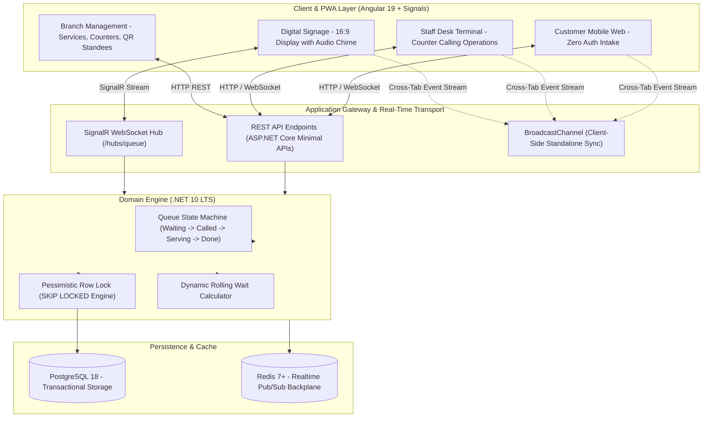

<div align="center">

# QueueFlow

### Enterprise Real-Time Distributed Queue Management System
**ระบบบริหารจัดการคิวและเคาน์เตอร์บริการแบบเรียลไทม์ระดับองค์กร**

[](https://queueflow-wheat.vercel.app)
[](https://angular.dev)
[](https://dotnet.microsoft.com)
[](https://web.dev/progressive-web-apps/)
[](https://tailwindcss.com)
[](https://postgresql.org)

<br />

**[English Documentation](#english) • [เอกสารภาษาไทย](#ภาษาไทย)**

<br />

</div>

---

## 🖼️ Visual Interface Showcase & Functional Walkthrough (ภาพรวมหน้าจอและฟังก์ชันการใช้งานจริง)

| 📱 Customer Mobile Intake (จุดกดรับบัตรคิวบนมือถือ) | 🎫 Real-time Digital Pass (บัตรคิวดิจิทัล) |
|:---:|:---:|
| [](https://queueflow-wheat.vercel.app/queue/join) | [](https://queueflow-wheat.vercel.app/queue/demo-token-a01) |
| **EN**: **Zero-App Mobile Intake Kiosk** — Visitors select their service category (`A`, `B`, `C`), view rolling Estimated Waiting Times (`~N mins`), enter optional visit notes, and obtain an instant cryptographically tokenized digital queue pass without app store downloads.<br/>**TH**: **จุดกดรับบัตรคิวบนมือถือแบบไม่ต้องโหลดแอป** — ลูกค้าเลือกหมวดหมู่บริการ (`A`, `B`, `C`), ตรวจสอบเวลารอคอยประเมินตามจำนวนคิวด้านหน้า (`~N นาที`), ระบุบันทึกเพิ่มเติมได้ และออกบัตรคิวดิจิทัลพร้อมโทเคนความปลอดภัยทันที | **EN**: **Real-Time Ticket Passport** — Live status tracker (`Waiting`, `Called`, `Serving`), dynamic position countdown (*"N Waiting Ahead"*), estimated wait countdown, verification QR code for physical teller scanner check-in, and instant self-service ticket cancellation.<br/>**TH**: **บัตรคิวดิจิทัลติดตามสถานะสด** — แสดงสถานะคิวแบบเรียลไทม์ (รอเรียก, กำลังเรียก, กำลังรับบริการ), นับถอยหลังจำนวนคิวที่รอด้านหน้า (*"N Waiting Ahead"*), คำนวณเวลารอคงเหลือ, มี QR Code สำหรับสแกนเช็คอินที่โต๊ะบริการ และปุ่มกดยกเลิกคิวด้วยตนเอง |

| 🖥️ Staff Desk Terminal (เคาน์เตอร์บริการเจ้าหน้าที่) | 📺 TV Digital Signage (จอแสดงผล 16:9 สาธารณะ) |
|:---:|:---:|
| [](https://queueflow-wheat.vercel.app/staff/dashboard) | [](https://queueflow-wheat.vercel.app/display) |
| **EN**: **Operational Teller Console** — Multi-counter switcher (`Counter 1`, `2`, `3`) with auto-activation, atomic *"Call Next"* queue intake (`SKIP LOCKED`), *"Recall"* sound chime & voice trigger, *"Start"*, *"Complete"*, *"Skip"*, priority elevation (*VIP / Elderly override*), active queue list, and live daily throughput metrics.<br/>**TH**: **แดชบอร์ดจัดการคิวประจำเคาน์เตอร์** — สลับโต๊ะบริการ (`Counter 1`, `2`, `3`) พร้อมเปิดเคาน์เตอร์อัตโนมัติ, ปุ่ม *"เรียกคิวถัดไป"* แบบป้องกันการชนกัน 100%, ปุ่ม *"ขานซ้ำ"* ส่งสัญญาณเสียงกระดิ่ง Chime และเสียงพูด, ปุ่มเริ่ม/เสร็จสิ้น/ข้ามคิว, ปุ่มลัดปรับระดับความสำคัญ (*VIP / ผู้สูงอายุ*) และมอนิเตอร์สถิติจำนวนคิวประจำวัน | **EN**: **16:9 High-Contrast TV Signage** — Live counter assignments (`Counters 1-3`), pulsing calling card animation, upcoming *"Next in Line"* board with estimated wait pills, synchronized digital clock, and automated bilingual voice synthesizer (*Thai / English*) + multi-tone airport chime.<br/>**TH**: **จอแสดงผลสาธารณะ 16:9 สำหรับสมาร์ททีวี** — แสดงสถานะช่องบริการ 1-3 แบบ High-Contrast, แอนิเมชันกะพริบแจ้งเตือนเมื่อมีคิวถูกเรียก, บอร์ดรายชื่อคิวถัดไป (*Next in Line*), นาฬิกาดิจิทัลเที่ยงตรง และระบบขานเรียกคิวด้วยเสียงสังเคราะห์ภาษาไทย/อังกฤษ พร้อมเสียงระฆัง Chime สไตล์สนามบิน |

| ⚙️ Branch Management (จัดการสาขาและโต๊ะบริการ) | 🖨️ Printable QR Standee (ป้ายตั้งโต๊ะพิมพ์ได้) |
|:---:|:---:|
| [](https://queueflow-wheat.vercel.app/admin/management) | [](https://queueflow-wheat.vercel.app/admin/management) |
| **EN**: **Administrative Branch Configuration** — Service category CRUD with letter prefix locking (`A`, `B`, `C`) and automated uniqueness validation, counter desk management with dedicated service bindings, branch store code/timezone settings, and instant launcher for printable QR standees.<br/>**TH**: **คอนโซลตั้งค่าสาขาและระบบบริการ** — เพิ่ม/แก้ไขหมวดหมู่บริการพร้อมระบบล็อกรหัสตัวอักษรย่อไม่ให้ซ้ำกัน (`A`, `B`, `C`), จัดการโต๊ะบริการและผูกประเภทบริการเฉพาะโต๊ะ (*Dedicated Service*), ปรับแต่งข้อมูลสาขา และเปิดเครื่องมือพิมพ์ป้าย QR Code ตั้งโต๊ะ | **EN**: **Print-Ready A4 QR Standee Generator** — Dual-mode standee generator (*Entrance kiosk vs Counter-specific desk tent*). Formatted for standard A4 paper folding with zero-app scanning instructions, high-resolution vector SVG QR codes, and direct browser print integration (`window.print`).<br/>**TH**: **ระบบสร้างป้าย QR Code ตั้งโต๊ะและป้ายทางเข้าพร้อมพิมพ์** — รองรับ 2 รูปแบบ ทั้งป้ายทางเข้ากดรับคิว และป้ายเต็นท์ตั้งโต๊ะประจำเคาน์เตอร์ ออกแบบตามขนาดกระดาษ A4 มีเส้นพับสามเหลี่ยมพร้อมคำแนะนำการสแกนโดยไม่ต้องลงแอป QR Code ความละเอียดสูงแบบเวกเตอร์ SVG สั่งพิมพ์ผ่านเบราว์เซอร์ได้ทันที |

---

### 🔍 Real-World Functional Architecture & Feature Matrix (เจาะลึกฟังก์ชันการทำงานจริงตามหน้าจอ)

The table below details the real production mechanics, user interactions, and engineering workflows built into each interface:

| Module / Portal | Real Capabilities & Engineering Mechanisms (EN) | ฟังก์ชันการทำงานจริงและกลไกเชิงวิศวกรรม (TH) |
|---|---|---|
| **1. Customer Mobile Intake** (`/queue/join`) | • **Dynamic Service Catalog**: Pulls live branch services with code prefixes (`A`, `B`, `C`) and designated durations.<br/>• **Rolling Wait Time (EWT)**: Calculates estimated wait dynamically based on `(queue_ahead + 1) * service_duration / active_counters`.<br/>• **Zero-Install PWA**: Instant scan-and-join experience directly from camera app with Home Screen installability.<br/>• **Anti-IDOR Security**: Issues cryptographically secure, high-entropy tokens (`demo-...`) preventing sequential ticket enumeration. | • **ดึงหมวดหมู่บริการสด**: แสดงประเภทบริการพร้อมรหัสตัวอักษรย่อ (`A`, `B`, `C`) และเวลาเฉลี่ยตามที่สาขาตั้งค่า<br/>• **คำนวณเวลารอเรียลไทม์**: ประเมินเวลารอคอยแบบไดนามิกจาก `(คิวก่อนหน้า + 1) * เวลาบริการ / จำนวนเคาน์เตอร์ที่เปิด`<br/>• **ไม่ต้องโหลดแอป**: สแกนแล้วใช้งานได้ทันทีบนเบราว์เซอร์มือถือ พร้อมรองรับการติดตั้งลงหน้าจอโฮม (PWA)<br/>• **ความปลอดภัยระดับสูง**: ออกรหัสโทเคนดิจิทัลแบบเข้ารหัส ป้องกันการแฮกหรือสุ่มเดาหมายเลขคิว (Anti-IDOR) |
| **2. Real-Time Digital Pass** (`/queue/:token`) | • **Live FSM State Sync**: Automatically updates across `Waiting` (0), `Called` (1), `Serving` (2), `Completed` (3), `Cancelled` (5).<br/>• **Queue Position Countdown**: Displays exact queue count ahead in the same service category with visual progress bar.<br/>• **Counter Check-in QR**: Generates dynamic vector QR code for physical barcode scanner check-in at the desk.<br/>• **Self-Service Cancellation**: Allows customers to voluntarily cancel tickets if leaving, instantly freeing queue slots. | • **ซิงก์สถานะคิวสด**: อัปเดตสถานะอัตโนมัติแบบเรียลไทม์ (รอเรียก, ถูกเรียกไปเคาน์เตอร์, กำลังรับบริการ, เสร็จสิ้น, ยกเลิก)<br/>• **นับถอยหลังลำดับคิว**: แสดงจำนวนคิวที่ยังอยู่ข้างหน้าอย่างแม่นยำ พร้อมแถบความคืบหน้า<br/>• **QR Code ประจำบัตรคิว**: แสดง QR Code ความละเอียดสูงสำหรับให้เจ้าหน้าที่ใช้เครื่องสแกนบาร์โค้ดเช็คอินหน้าเคาน์เตอร์<br/>• **กดยกเลิกคิวด้วยตนเอง**: ให้ลูกค้ากดสละสิทธิ์หรือยกเลิกคิวได้เองทันทีเมื่อติดธุระ เพื่อคืนคิวให้ผู้อื่นในระบบ |
| **3. Staff Desk Terminal** (`/staff/dashboard`) | • **Multi-Counter Selector**: Dynamic dropdown switching between physical desks (`Counter 1`, `2`, `3`) with automatic counter activation.<br/>• **Atomic "Call Next"**: Acquires row lock using `FOR UPDATE SKIP LOCKED`, preventing race conditions across multiple tellers.<br/>• **Full Ticket Lifecycle Actions**: One-click `Recall` (triggers audio chime & speech broadcast), `Start Service`, `Complete`, `Skip`, and `No-Show`.<br/>• **Priority Escalation**: Staff can bump priority of emergency or senior citizen tickets to head of line.<br/>• **Live Telemetrics Ledger**: Displays waiting queue table with elapsed minutes and daily throughput statistics. | • **สลับโต๊ะบริการแบบไดนามิก**: เลือกระบุโต๊ะบริการที่ตนเองประจำอยู่ (`Counter 1`, `2`, `3`) พร้อมเปิดสถานะโต๊ะอัตโนมัติ<br/>• **ระบบกดเรียกคิวไร้การชนกัน**: ล็อกแถวฐานข้อมูลแบบ Atomic ป้องกันปัญหาเจ้าหน้าที่ 2 โต๊ะกดเรียกได้คิวเดียวกัน 100%<br/>• **ปุ่มควบคุมการบริการครบวงจร**: กดเรียกคิวถัดไป, ขานคิวซ้ำ (ส่งเสียงกระดิ่งและเสียงพูดไปที่จอทีวี), เริ่มบริการ, จบงาน, และข้ามคิว<br/>• **ปรับความสำคัญเร่งด่วน**: สต๊าฟสามารถกดยกระดับคิวพิเศษ (ผู้สูงอายุ / เคสฉุกเฉิน) ให้ขึ้นมาอยู่หัวแถวได้ทันที<br/>• **มอนิเตอร์คิวและสถิติสด**: แสดงรายการคิวที่รอพร้อมจำนวนนาทีที่รอคอย และสถิติจำนวนผู้รับบริการสะสมประจำวัน |
| **4. TV Digital Signage** (`/display`) | • **High-Contrast 16:9 Signage**: Designed for Smart TVs with full-screen kiosk toggle, dark/light styling, and 0 distraction UI.<br/>• **Active Counter Cards**: Highlights assigned counters and serving ticket numbers with flashing pulse effects on call.<br/>• **Upcoming Queue Board**: Displays next 4-8 tickets in line with estimated wait badges (~N mins).<br/>• **Bilingual Speech & Airport Chime**: Web Audio API generated dual-tone chime followed by Web Speech API voice calling in Thai and English.<br/>• **Digital Clock & Subtitle**: Dead-center digital clock with locale-aware day/month/year format and branch status. | • **จอแสดงผล 16:9 สำหรับสมาร์ททีวี**: หน้าจอ High-Contrast ชัดเจนจากระยะไกล ไร้แถบควบคุม พร้อมโหมดเต็มจอ Fullscreen Kiosk<br/>• **การ์ดแสดงสถานะโต๊ะบริการ**: แสดงเลขคิวที่กำลังรับบริการแต่ละเคาน์เตอร์ พร้อมเอฟเฟกต์กะพริบแจ้งเตือนเมื่อมีคิวใหม่ถูกเรียก<br/>• **กระดานคิวถัดไป (Next in Line)**: แสดงรายการคิวที่ใกล้ถึงรอบถัดไป 4-8 ลำดับ พร้อมป้ายเวลารอโดยประมาณ<br/>• **ระบบเสียงกระดิ่งและเสียงพูด 2 ภาษา**: สังเคราะห์เสียงระฆัง Chime สไตล์สนามบิน และขานหมายเลขคิวเป็นภาษาไทยและอังกฤษแบบเรียลไทม์<br/>• **นาฬิกาดิจิทัลเที่ยงตรง**: แสดงเวลาและวันที่ภาษาไทย/อังกฤษอย่างแม่นยำ พร้อมชื่อสาขา |
| **5. Branch Management** (`/admin/management`) | • **Service CRUD & Prefix Locking**: Configure service categories with letter prefixes (`A`, `B`, `C`), enforcing prefix uniqueness.<br/>• **Counter Desk Mapping**: Create and manage counters, auto-calculate counter numbers, and assign dedicated service bindings.<br/>• **Branch Metadata Controls**: Update branch legal name, store identification code (`BKK01`), and operational timezone.<br/>• **Standee Generator Launcher**: One-click action launcher to generate print-ready counter and entrance QR standees. | • **จัดการหมวดบริการและล็อกรหัสย่อ**: เพิ่ม/แก้ไขประเภทบริการ พร้อมระบบตรวจสอบห้ามใช้ตัวย่อ (`A`, `B`, `C`) ซ้ำกันในสาขา<br/>• **กำหนดค่าโต๊ะบริการ**: เพิ่ม/แก้ไขเคาน์เตอร์ รันหมายเลขโต๊ะอัตโนมัติ และกำหนดประเภทบริการเฉพาะโต๊ะ (Dedicated Service)<br/>• **ตั้งค่าข้อมูลสาขา**: ปรับปรุงชื่อสาขา, รหัสสาขา (`BKK01`) และเขตเวลาการทำงาน<br/>• **เครื่องมือสร้างป้าย QR Code**: กดเปิดป๊อปอัปสร้างป้าย QR Code สำหรับพิมพ์ตั้งโต๊ะหรือตั้งหน้าทางเข้าได้ทันที |
| **6. Printable QR Standee Generator** | • **Dual Layout Templates**: Generates Entrance Kiosk standee or Counter-specific tent fold standee.<br/>• **Standard A4 Folding Structure**: Formatted for standard A4 paper with fold/cut guidelines for physical acrylic holders.<br/>• **Camera Scanning Instructions**: Printed guide educating visitors on direct camera scanning with zero app installation.<br/>• **Vector SVG QR Code**: Sharp vector rendering (`#0f172a`) with high contrast ensuring instant mobile focus.<br/>• **Native Browser Print**: Directly triggers `window.print()` with `@media print` clean sheet optimizations. | • **รองรับ 2 รูปแบบมาตรฐาน**: เลือกสร้างได้ทั้งป้ายทางเข้าสำหรับกดรับคิวทั่วไป และป้ายเต็นท์ตั้งโต๊ะประจำเคาน์เตอร์<br/>• **เลย์เอาต์กระดาษ A4 พับสามเหลี่ยม**: จัดวางตามขนาด A4 มีเส้นบอกแนวพับสำหรับใส่กรอบอะคริลิกตั้งโต๊ะหน้าร้านได้ทันที<br/>• **คำแนะนำสแกนแบบเข้าใจง่าย**: พิมพ์ข้อความแนะนำลูกค้าให้สแกนผ่านกล้องมือถือได้ทันที ไม่ต้องดาวน์โหลดแอปพลิเคชัน<br/>• **QR Code เวกเตอร์ SVG คมชัดสูง**: เรนเดอร์ด้วยความละเอียดคมชัดสูง จับโฟกัสกล้องมือถือได้รวดเร็วแม้แสงน้อย<br/>• **สั่งพิมพ์ผ่านเบราว์เซอร์ทันที**: เชื่อมต่อคำสั่ง `window.print()` พร้อมเทมเพลต CSS Print ซ่อนส่วนเกินที่ไม่จำเป็นเวลาพิมพ์ |

---

<a name="english"></a>
## English Documentation

### 1. Product Overview (The 7 Pillars)

#### Who (Target Audience & Personas)
* **Customers & Visitors**: Patients in medical clinics, banking hall clients, repair center patrons, and government service visitors who need real-time queue visibility without standing in crowded waiting rooms.
* **Service Counter Staff**: Tellers, customer service representatives, and triage nurses operating dedicated physical or virtual service desks.
* **Branch Supervisors & Managers**: Floor managers monitoring throughput, active counter states, bottleneck alerts, and average waiting time SLAs.
* **System Administrators**: Multi-tenant platform operators configuring organizations, managing service categories, and auditing operational logs.

#### Problem
1. **Waiting Room Congestion**: Customers are physically bound to lobbies without transparency into remaining wait times or current serving positions.
2. **Double-Call Concurrency Collisions**: In high-velocity service environments, multiple staff members hitting "Call Next" simultaneously risk duplicate ticket assignments.
3. **Hardware Lock-in & Licensing Costs**: Traditional queue hardware vendors charge recurring per-terminal licensing and necessitate proprietary thermal printers.

#### Solution
* **Zero-Friction Mobile Web Intake**: Customers scan a service QR code, pick their service category, and receive a cryptographically tokenized digital pass directly on their smartphone.
* **Pessimistic Concurrency Engine**: PostgreSQL `SELECT ... FOR UPDATE SKIP LOCKED` guarantees absolute mutual exclusion across concurrent counter requests.
* **Bi-Directional Real-Time Push**: SignalR WebSocket channels update customer positions, staff terminals, and public displays with sub-millisecond latency.
* **Client-First PWA Architecture**: Operates as a Progressive Web App installable on iOS, Android, tablets, and smart TVs with offline shell support and zero native app downloads.

---

### 2. Live Demo & Portals

The application is deployed on Vercel as a high-performance, standalone Progressive Web App (PWA):

| Interface Portal | Route | Primary Use Case | Live Access |
|---|---|---|---|
| **Customer Intake** | `/queue/join` | Mobile intake with service selection and instant token issuance | [Launch Customer Portal](https://queueflow-wheat.vercel.app/queue/join) |
| **Staff Desk Terminal** | `/staff/dashboard` | Calling next ticket, recall chime, start service, skip, no-show | [Launch Staff Terminal](https://queueflow-wheat.vercel.app/staff/dashboard) |
| **TV Digital Signage** | `/display` | 16:9 full-screen digital display with audio chime and bilingual speech | [Launch TV Signage](https://queueflow-wheat.vercel.app/display) |
| **Branch Management** | `/admin/management` | Configure services, counter bindings, and generate printable QR standees | [Launch Admin Console](https://queueflow-wheat.vercel.app/admin/management) |

> [!TIP]
> **Multi-Window Real-Time Simulation**: Open the [Staff Terminal](https://queueflow-wheat.vercel.app/staff/dashboard) in one window and the [TV Display](https://queueflow-wheat.vercel.app/display) in another window. When you click **"Call Next"** on the staff desk, the TV display instantly rings the service chime and synthesizes the voice announcement in real time via the integrated event bus!

---

### 3. Core Capabilities

* **Intelligent Intake & EWT**: Computes rolling-average Estimated Waiting Time (EWT) dynamically based on historical service duration and active counter capacity.
* **Cross-Counter Priority Dispatch**: Allows VIP ticket priority elevation, service transfers, and multi-service teller routing.
* **Acoustic & Voice Synthesis**: Uses Web Audio API for custom chime frequencies and Web Speech API for localized ticket calling in Thai and English.
* **Printable Standee Generator**: Automatically renders print-ready SVG QR codes for physical counter stands and triage kiosks (A4 and table tent format).
* **Dual Runtime Engine**: Runs seamlessly as a serverless in-memory PWA on Vercel or connected to a high-scale .NET 10 LTS container backend with PostgreSQL.

---

### 4. Technical Architecture



---

### 5. Engineering Craftsmanship & Concurrency Evidence

#### Double-Call Race Condition Immunity
When multiple counter operators click "Call Next" in the same millisecond, standard database queries suffer from race conditions resulting in double ticket assignments. QueueFlow resolves this at the database engine level:

```csharp
// Atomically locks the next waiting ticket, bypassing rows locked by other concurrent transactions
var ticket = await _dbContext.Tickets
    .FromSqlRaw(@"
        SELECT * FROM ""Tickets""
        WHERE ""BranchId"" = {0} AND ""Status"" = 0
        ORDER BY ""Priority"" DESC, ""IssuedAt"" ASC
        LIMIT 1
        FOR UPDATE SKIP LOCKED", branchId)
    .FirstOrDefaultAsync(cancellationToken);
```

#### Verification & Automated Test Suite
All domain state machine transitions, priority escalation rules, and concurrency locks are covered by automated unit and integration tests passing with **Exit Code 0**:

```powershell
dotnet test backend/QueueFlow.Tests/QueueFlow.Tests.csproj --nologo -v q
# Passed! - Failed: 0, Passed: 7, Skipped: 0, Total: 7, Duration: 1 s
```

---

### 6. Local Development Quickstart

#### Prerequisites
* Node.js 22+ & npm
* .NET 10 LTS SDK

```powershell
# 1. Clone the repository
git clone https://github.com/ZillerDX/QueueFlow.git
cd QueueFlow

# 2. Launch Backend (.NET 10 LTS)
cd backend/QueueFlow.Api
dotnet run --urls "http://localhost:5080"

# 3. Launch Frontend (Angular 19 Dev Server with HMR)
cd ../../queueflow-web
npm install
npx ng serve --port 4200
```

Open [http://localhost:4200](http://localhost:4200) in your browser.

---

<br />

<a name="ภาษาไทย"></a>
## เอกสารภาษาไทย (Thai Documentation)

### 1. ภาพรวมผลิตภัณฑ์และ 7 เสาหลัก (The 7 Pillars)

#### ใครคือผู้ใช้งาน (Who)
* **ผู้รับบริการ / ลูกค้า (Customers)**: ผู้ป่วยในคลินิก, ลูกค้าธนาคาร, ผู้มาซ่อมอุปกรณ์, หรือประชาชนผู้มาติดต่อหน่วยงาน ที่ต้องการความสะดวกในการติดตามคิวผ่านมือถือโดยไม่ต้องยืนเบียดเสียดในห้องรอ
* **พนักงานประจำเคาน์เตอร์ (Staff Desk)**: เจ้าหน้าที่ประจำจุดบริการที่ต้องเรียกคิว, ขานซ้ำ, เริ่มให้บริการ, ข้ามคิว หรือแจ้งสละสิทธิ์ได้อย่างสะดวกรวดเร็ว
* **ผู้จัดการสาขา (Branch Supervisors)**: ผู้ดูแลภาพรวมการให้บริการ ตรวจสอบอัตราการไหลของคิว ประสิทธิภาพของแต่ละเคาน์เตอร์ และแจ้งเตือนเมื่อเวลารอเกิน SLA
* **ผู้ดูแลระบบ (Administrators)**: ผู้กำหนดโครงสร้างสาขา จัดการประเภทบริการ (Service Code) และตั้งค่าโต๊ะบริการ

#### ปัญหาที่พบในระบบเดิม (Problem)
1. **ความแออัดในพื้นที่รอรับบริการ**: ลูกค้าไม่รู้เวลารอที่แน่นอน ทำให้ต้องนั่งเฝ้าหน้าจอทีวีหรือตู้กดคิวตลอดเวลา
2. **การเรียกคิวซ้ำซ้อน (Race Condition)**: เมื่อเจ้าหน้าที่หลายเคาน์เตอร์กด "เรียกคิวถัดไป" พร้อมกันในเสี้ยววินาที ระบบทั่วไปอาจจ่ายบัตรคิวใบเดียวกันให้สองเคาน์เตอร์พร้อมกัน
3. **ต้นทุนฮาร์ดแวร์สูง**: ตู้บัตรคิวแบบดั้งเดิมมีค่าไลเซนส์รายปี และต้องพึ่งพาตู้พิมพ์กระดาษความร้อนที่สิ้นเปลือง

#### โซลูชันของ QueueFlow (Solution)
* **สแกนรับคิวผ่านมือถือ (Zero-Friction Intake)**: สแกน QR Code แล้วเลือกบริการผ่านเว็บเบราว์เซอร์ได้ทันที ได้รับบัตรคิวแบบดิจิทัลพร้อมความปลอดภัยระดับโทเคน
* **ระบบล็อกแถวฐานข้อมูลแบบ Pessimistic Locking**: ใช้คำสั่ง `SELECT ... FOR UPDATE SKIP LOCKED` บน PostgreSQL การันตีไม่มีการเรียกคิวซ้ำซ้อน 100%
* **การสื่อสารแบบเรียลไทม์สองทาง**: SignalR WebSocket แจ้งเตือนการเปลี่ยนสถานะคิวไปยังมือถือลูกค้าและจอทีวีโดยไม่ต้องรีเฟรชหน้าเว็บ
* **สถาปัตยกรรม PWA**: ติดตั้งลงบนมือถือ แท็บเล็ต หรือสมาร์ททีวีเป็นแอปพลิเคชันได้ทันทีโดยไม่ต้องผ่าน App Store

---

### 2. ทางเข้าใช้งานระบบทดสอบ (Live Portals)

ระบบเปิดให้บริการทดสอบแบบ Standalone Progressive Web App (PWA) บน Vercel:

| พอร์ทัลการใช้งาน | เส้นทาง URL | วัตถุประสงค์หลัก | ลิงก์เข้าใช้งาน |
|---|---|---|---|
| **จุดกดรับบัตรคิวลูกค้า** | `/queue/join` | สแกนเลือกประเภทบริการและรับบัตรคิวดิจิทัล | [เปิดหน้าจอลูกค้า](https://queueflow-wheat.vercel.app/queue/join) |
| **เคาน์เตอร์บริการพนักงาน** | `/staff/dashboard` | เรียกคิวถัดไป, ขานซ้ำ, เริ่มบริการ, ข้ามคิว, ยกเลิกคิว | [เปิดหน้าจอพนักงาน](https://queueflow-wheat.vercel.app/staff/dashboard) |
| **จอแสดงผลดิจิทัลทีวี** | `/display` | จอแสดงผลแบบ 16:9 พร้อมเสียงระฆังและเสียงพูดขานคิว | [เปิดหน้าจอทีวี](https://queueflow-wheat.vercel.app/display) |
| **ระบบจัดการสาขาและเคาน์เตอร์** | `/admin/management` | จัดการประเภทบริการ ผูกเคาน์เตอร์ และพิมพ์ป้าย QR Code | [เปิดหน้าจอแอดมิน](https://queueflow-wheat.vercel.app/admin/management) |

> [!TIP]
> **วิธีทดสอบระบบเรียลไทม์ข้ามหน้าต่าง**: ให้คุณเปิดหน้าจอ [เคาน์เตอร์บริการพนักงาน](https://queueflow-wheat.vercel.app/staff/dashboard) ในหน้าต่างหนึ่ง และเปิดหน้าจอ [จอแสดงผลทีวี](https://queueflow-wheat.vercel.app/display) อีกหน้าต่างหนึ่ง เมื่อกดปุ่ม **"เรียกคิวถัดไป"** จอแสดงผลทีวีจะส่งเสียงกระดิ่ง Chime และขานหมายเลขคิวเป็นภาษาไทยแบบเรียลไทม์ทันที!

---

### 3. คุณสมบัติเด่นของระบบ

* **การคำนวณเวลารออัจฉริยะ (EWT)**: ประเมินเวลารอคอยเฉลี่ยแบบไดนามิกโดยคำนวณจากระยะเวลาให้บริการจริงและจำนวนเคาน์เตอร์ที่เปิดอยู่
* **ระบบจัดการความสำคัญ (Priority Handling)**: ยกระดับความสำคัญของคิวพิเศษ (ผู้สูงอายุ, เคสฉุกเฉิน) ให้อยู่ลำดับต้นแบบอัตโนมัติ
* **เสียงขานสังเคราะห์ 2 ภาษา**: ใช้ Web Audio API สร้างเสียงระฆังนุ่มนวล และ Web Speech API สังเคราะห์เสียงขานหมายเลขคิวภาษาไทยและอังกฤษ
* **เครื่องมือสร้างป้าย QR Code ตั้งโต๊ะ**: สร้างป้ายตั้งเคาน์เตอร์และป้ายทางเข้าพร้อมพิมพ์ขนาด A4 พับสามเหลี่ยมได้จากหน้าแดชบอร์ด

---

### 4. สถาปัตยกรรมทางเทคนิค

* **Frontend**: Angular 19+, TypeScript, Angular Signals, Tailwind CSS v4, Progressive Web App (PWA)
* **Backend**: C# 14, **.NET 10 LTS (`net10.0`)**, ASP.NET Core Minimal APIs, Entity Framework Core 10, SignalR WebSocket
* **Database**: PostgreSQL 18 (Production) / SQLite (Local Development)
* **Caching**: Redis 7+ Pub/Sub Backplane

---

### 5. การติดตั้งและรันในเครื่อง (Local Setup)

```powershell
# 1. โคลนคลังโค้ด
git clone https://github.com/ZillerDX/QueueFlow.git
cd QueueFlow

# 2. เริ่มต้นรัน Backend (.NET 10)
cd backend/QueueFlow.Api
dotnet run --urls "http://localhost:5080"

# 3. เริ่มต้นรัน Frontend (Angular 19)
cd ../../queueflow-web
npm install
npx ng serve --port 4200
```

เปิดเบราว์เซอร์ไปที่ [http://localhost:4200](http://localhost:4200) เพื่อเริ่มใช้งาน

---

### 6. ใบอนุญาต (License)

ซอฟต์แวร์นี้เผยแพร่ภายใต้ใบอนุญาต **MIT License** — สามารถนำไปพัฒนา ต่อยอด หรือใช้งานในเชิงพาณิชย์ได้อย่างเสรี
